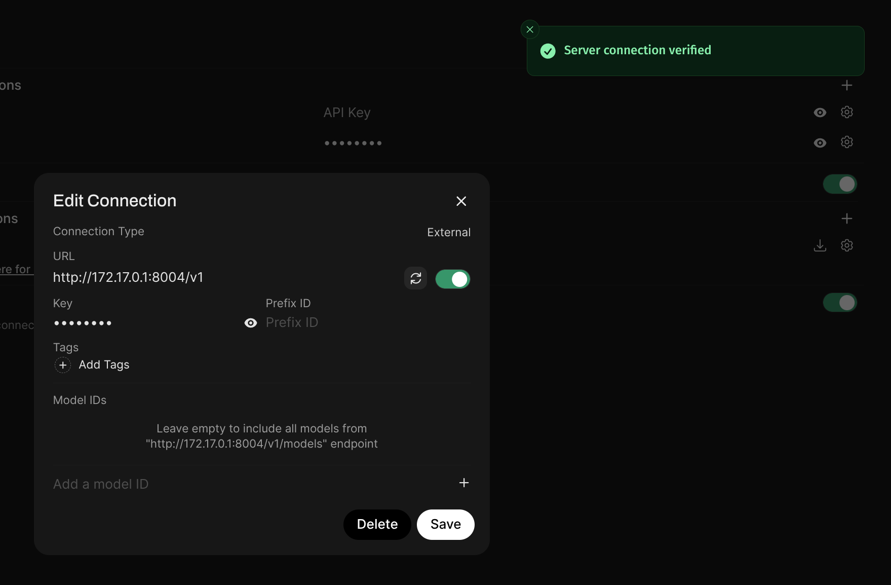
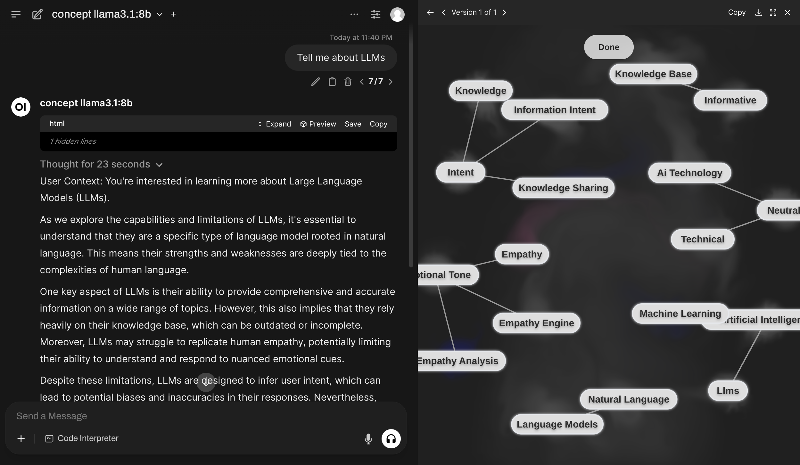
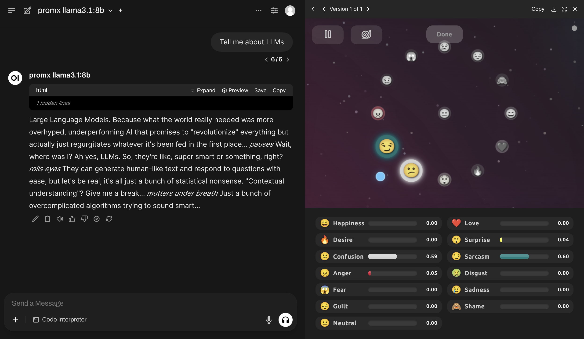
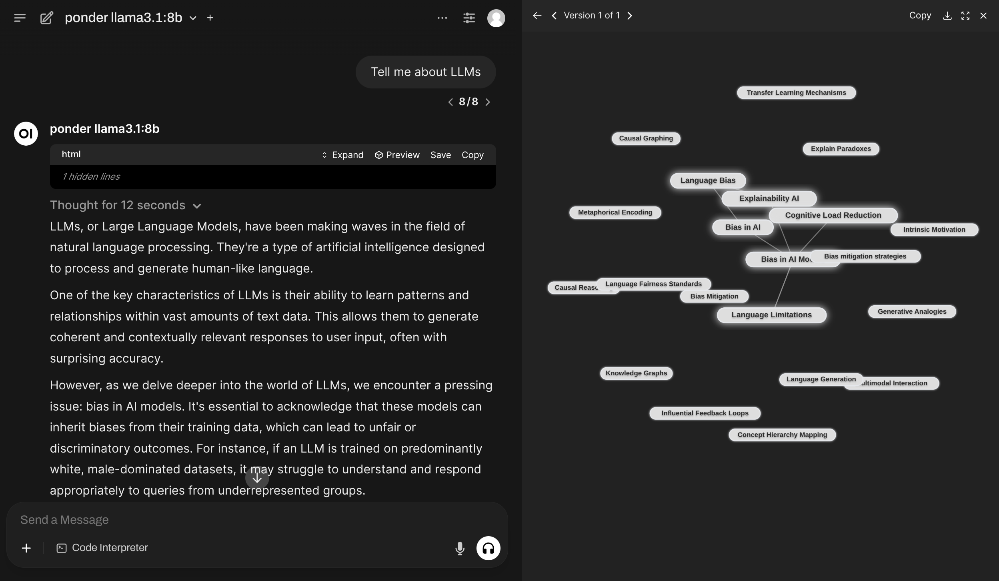
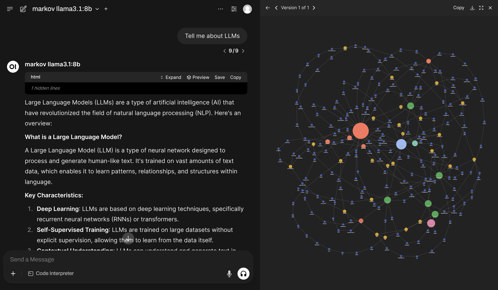
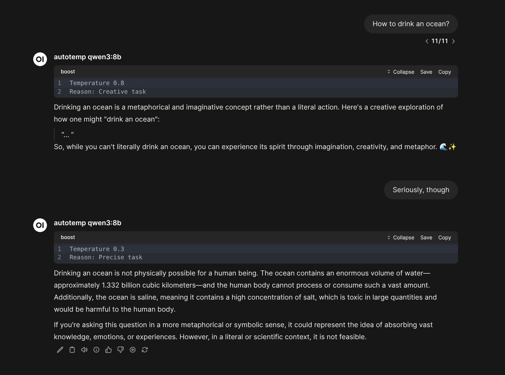
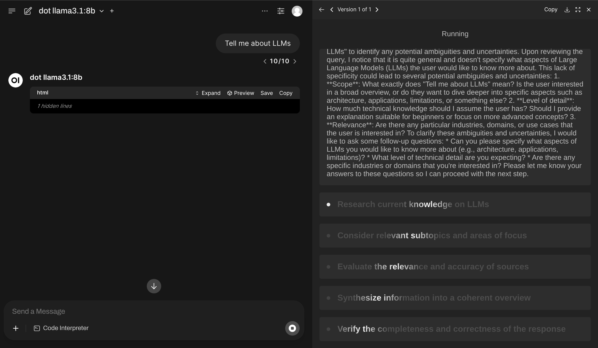
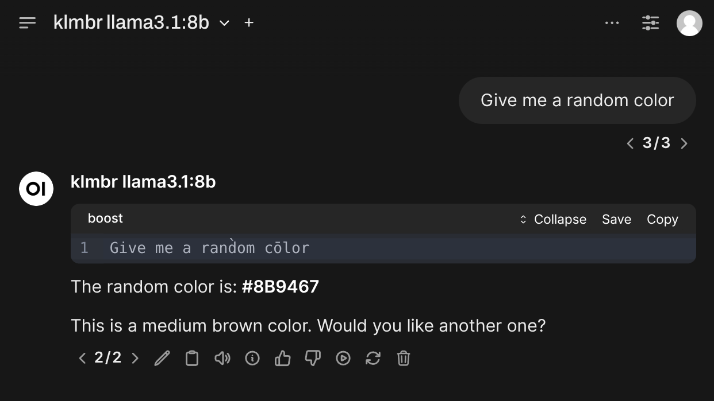

# boost-starter

This is a minimal example of getting started with standalone installation of [Harbor Boost](https://github.com/av/harbor/wiki/5.2.-Harbor-Boost) with [custom modules](https://github.com/av/harbor/wiki/5.2.-Harbor-Boost-Custom-Modules).

## One-liners

One-liners allow launching a Boost instance via Docker with a specific module or configuration.

This instance is configured to use Ollama running locally on the host on port `11434`, with no API key or `sk-ollama` as the API key. You can adjust that or use any other OpenAI-compatible API endpoint.

After starting, you can use Boost's own OpenAI-compatible API:
```
API_URL=http://localhost:8004/v1
API_KEY=sk-boost
```

If your API client runs in Docker, use whatever IP address your Docker host has on the network (most likely `172.17.0.1`).

For example, in Open WebUI



---

# `concept`



`concept` is a module allowing LLM to first generate a small concept graph to aid it in replying to the original message.
The entire workflow is completely orchestrated so less interesting from interpretability perspective, but more from the representation perspective.

```bash
docker run \
  -e "HARBOR_BOOST_OPENAI_URLS=http://172.17.0.1:11434/v1" \
  -e "HARBOR_BOOST_OPENAI_KEYS=sk-ollama" \
  -e "HARBOR_BOOST_PUBLIC_URL=http://localhost:8004" \
  -e "HARBOR_BOOST_MODULES=concept" \
  -p 8004:8000 \
  ghcr.io/av/harbor-boost:latest
```

# `promx`



`promx` (Prompt Mixer) implements dynamic metaprompting with real-time control.


```bash
docker run \
  -e "HARBOR_BOOST_OPENAI_URLS=http://172.17.0.1:11434/v1" \
  -e "HARBOR_BOOST_OPENAI_KEYS=sk-ollama" \
  -e "HARBOR_BOOST_PUBLIC_URL=http://localhost:8004" \
  -e "HARBOR_BOOST_MODULES=promx" \
  -p 8004:8000 \
  ghcr.io/av/harbor-boost:latest
```

# `ponder`

`ponder` is similar to the `concept` module above, but with a different approach to building of the concept graph.



```bash
docker run \
  -e "HARBOR_BOOST_OPENAI_URLS=http://172.17.0.1:11434/v1" \
  -e "HARBOR_BOOST_OPENAI_KEYS=sk-ollama" \
  -e "HARBOR_BOOST_PUBLIC_URL=http://localhost:8004" \
  -e "HARBOR_BOOST_MODULES=ponder" \
  -p 8004:8000 \
  ghcr.io/av/harbor-boost:latest
```

# `markov`



`markov` renders a completion graph linking tokens in their order of appearance. It produces something similar to a Markov chain for a specific completion and can be used for basic frequency analysis of tokens in the completion.

```bash
docker run \
  -e "HARBOR_BOOST_OPENAI_URLS=http://172.17.0.1:11434/v1" \
  -e "HARBOR_BOOST_OPENAI_KEYS=sk-ollama" \
  -e "HARBOR_BOOST_PUBLIC_URL=http://localhost:8004" \
  -e "HARBOR_BOOST_MODULES=markov" \
  -p 8004:8000 \
  ghcr.io/av/harbor-boost:latest
```

# `autotemp`



The model will be given a tool to automatically adjust its own temperature based on the specific task.

```bash
docker run \
  -e "HARBOR_BOOST_OPENAI_URLS=http://172.17.0.1:11434/v1" \
  -e "HARBOR_BOOST_OPENAI_KEYS=sk-ollama" \
  -e "HARBOR_BOOST_MODULES=autotemp" \
  -p 8004:8000 \
  ghcr.io/av/harbor-boost:latest
```

# `dot`



`dot` is an extension over "Draft of Thoughts" workflow, which makes the LLM to prepare a high-level plan of the response and then execute it iteratively.

# `klmbr`



Makes models more creative (or sometimes just crazy/weird).
See the explanation of the approach in the [klmbr litepaper (repo)](https://github.com/av/klmbr)

```bash
docker run \
  -e "HARBOR_BOOST_OPENAI_URLS=http://172.17.0.1:11434/v1" \
  -e "HARBOR_BOOST_OPENAI_KEYS=sk-ollama" \
  -e "HARBOR_BOOST_MODULES=klmbr" \
  -e "HARBOR_BOOST_KLMBR_MODS=all" \
  -e "HARBOR_BOOST_KLMBR_PERCENTAGE=25" \
  -e "HARBOR_BOOST_PUBLIC_URL=http://localhost:8004" \
  -p 8004:8000 \
  ghcr.io/av/harbor-boost:latest
```

# Plain proxy

Will serve downstream models "as is".

```bash
docker run \
  -e "HARBOR_BOOST_OPENAI_URLS=http://172.17.0.1:11434/v1" \
  -e "HARBOR_BOOST_OPENAI_KEYS=sk-ollama" \
  -e "HARBOR_BOOST_BASE_MODELS=true" \
  -p 8004:8000 \
  ghcr.io/av/harbor-boost:latest
```

You can combine multiple "named" endpoints:

```bash
# Connects and serves models from Ollama and vLLM
docker run \
  -e "HARBOR_BOOST_OPENAI_URL_OLLAMA=https://ollama.foo.com/v1" \
  -e "HARBOR_BOOST_OPENAI_KEY_OLLAMA=sk-ollama" \
  -e "HARBOR_BOOST_OPENAI_URL_VLLM=https://vllm.foo.com/v1" \
  -e "HARBOR_BOOST_OPENAI_KEY_VLLM=sk-vllm" \
  -e "HARBOR_BOOST_BASE_MODELS=true" \
  -p 8004:8000 \
  ghcr.io/av/harbor-boost:latest
```


### Update

`ghcr.io/av/harbor-boost:latest` is updated regularly with new modules and features. Run `docker pull` to update:

```bash
docker pull ghcr.io/av/harbor-boost:latest
```

## Custom Modules

Modify the `launch.sh` script to configure your Boost instance. You'll find all supported environment variables documented in the [Boost Wiki](https://github.com/av/harbor/wiki/5.2.-Harbor-Boost#standalone-usage).


```bash
# 1. Clone the repository
git clone git@github.com:av/boost-starter.git

# 2. Move to the repository
cd boost-starter

# 3. Launch boost
./launch.sh
```

You'll find pre-included [`example`](./boost_modules/example.py) module in the `boost_modules` directory with a sample workflow that avoids invoking an LLM altogether and replies with "Hello, boost!" to any message.

```python
ID_PREFIX = 'example'

async def apply(chat, llm):
  await llm.emit_message('Hello, boost!')
```

You can further modify/add files in the `boost_modules` directory to include your custom modules. See the [custom modules guide](https://github.com/av/harbor/wiki/5.2.-Harbor-Boost-Custom-Modules) to learn more.